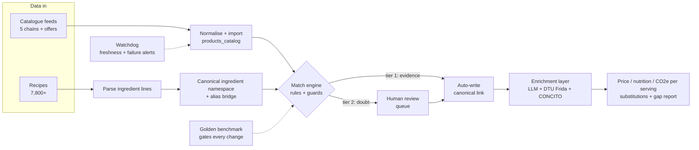

# Grocery Intelligence Pipeline

> **Deterministic ingredient–product matching for Danish supermarket catalogues,
> running on Cloudflare Edge with zero cold-start latency.**

A battle-tested data pipeline that solves one of the messiest problems in food-tech:
making the raw, inconsistent product catalogues from Danish supermarket chains -
catalogue integrations built for five chains (Bilka, Rema 1000, Føtex, Netto, Nemlig)
plus offer-catalogue feeds from nine more - reliably queryable by canonical ingredient
name. As of July 2026 the live daily price syncs focus on Bilka and Rema 1000; the
remaining catalogues are preserved as a historical archive. The architecture is
BYOD-first: any catalogue owner can feed their own product data through the same
ingestion path.

Built as the price and nutrition backbone of **[Savori](https://savori.dk)** -
a Danish meal-planning and smart-shopping app.

## TL;DR (the 2-minute version)

- **The problem:** supermarket catalogues are structurally noisy - searching "strawberry"
  returns yoghurt, jam and smoothies ([The Yoghurt Trap](#the-problem-the-yoghurt-trap-and-friends))
- **The approach:** a deterministic two-tier match engine with quality gates and a
  Human-in-the-Loop review queue. AI is a tool in the solution, not the solution -
  it ranks and explains; only evidence writes ([Architecture](#the-architecture))
- **The quality bar:** every change to the matching layer must pass a 600+ case
  hand-labelled benchmark before it ships - precision 0.81 / recall 0.92
  ([Golden Benchmark](#measured-quality-the-golden-benchmark))
- **Self-auditing:** the system logs where it lacks knowledge and writes a prioritized
  shopping list for data collection
  ([Self-Auditing Knowledge](#self-auditing-knowledge-the-data-shopping-list))
- **Battle-tested:** the safeguards exist because a naive auto-linker once produced
  121,000 wrong aliases ([Lessons Learned](#lessons-learned))

### The pipeline at a glance



## Production Scale (July 2026)

| Metric | Value |
|---|---|
| Products in catalogue | 46,000+ across 14 retail data sources |
| Historical price points | 323,000+ (collected since May 2026; live daily sync now Bilka + Rema 1000) |
| Recipes priced end-to-end | 7,800+ with cost, nutrition and CO2e per serving |
| Ingredient → product resolution | ~90 % of ingredient rows in production recipes resolve to a purchasable product (usage-weighted - measured on actual recipe usage, not on the prettiest subset) |
| Downstream layers | CONCITO climate footprints, DTU Frida nutrition, culinary substitution graph |

**How these numbers are measured** (figures as of July 2026):

| Number | How it is counted |
|---|---|
| 46,000+ products | Row count of the unified product catalogue table, across 14 source feeds |
| 323,000+ price points | Rows in the price history table, appended by the daily syncs since May 2026 |
| 7,800+ recipes priced | Recipes with a computed cost, nutrition and CO2e per serving |
| ~90 % resolution | **Usage-weighted**: share of ingredient *rows* in production recipes that resolve to a purchasable product. Measured on occurrences, not distinct names - deliberately the less flattering metric (a rare exotic spice failing counts less than butter failing) |
| precision 0.81 / recall 0.92 | The full engine against the 600+ pair hand-labelled benchmark ([methodology below](#measured-quality-the-golden-benchmark)) |

Everything runs serverless: the same Cloudflare account hosts the pipeline crons,
the database, the vector indexes and the consumer-facing API.

---

## The Problem: The Yoghurt Trap (and Friends)

Supermarket catalogue APIs are structurally noisy. Consider what happens when you
naively search for an ingredient:

| Ingredient | What the catalogue returns |
|---|---|
| `jordbær` (strawberry) | Strawberry yoghurt. Strawberry juice. Strawberry jam. Strawberry smoothie. Occasionally actual strawberries. |
| `tun` (tuna) | Tuna. Tuna salad. Tuna pasta. Tuna-flavoured cat food (yes, really). |
| `smør` (butter) | Butter. Butter-flavoured spread. Butter chicken sauce. Peanut butter. |
| `olie` (oil) | Olive oil - plus every single product "in oil" (sardines, sun-dried tomatoes, artichokes…). |
| `mælk` (milk) | Milk - and also oat milk, almond milk, chocolate milk, and condensed milk. |

Simple substring matching fails completely. Even fuzzy matching falls into the
**brand trap**: "sukker" (sugar) matches Dansukker's entire product line, including
syrups; "jordbær" hits every Arla Cultura flavour.

A naïve auto-linker I tested early in development produced **121,000 wrong aliases**
before a safety check caught it - including Affaldsposer (bin liners) mapped to
æg (eggs), and Pepsi mapped to bacon. The catalogue is that dirty.

---

## The Architecture

The pipeline is built around three core ideas:

### 1. Canonical Ingredient Namespace

Every ingredient in the system is registered in `ingredients_master` with a single,
stable, lowercase canonical name (e.g. `"smør"`, `"kyllingebryst"`, `"mozzarella"`).

Store products do **not** define the namespace - they map **into** it.
Spelling variants, brand names, and recipe shorthand are normalised through
`ingredient_aliases` before they ever touch the matching layer.

```
Recipe text: "Kærgården smør"
     ↓  alias lookup
Canonical:   "smør"
     ↓  match engine
Products:    bilka:12345  rema:67890  foetex:11111
```

### 2. Deterministic Two-Tier Match Engine

The heart of the pipeline (`src/workers/match-engine.js`).

Each active rule in `ingredient_match_rules` specifies:
- An **include token** - what word or phrase must appear in the product name
- An **exclude list** - words that immediately disqualify the match
- A **category whitelist** - which store category labels are allowed
- A **mode** - `word` or `phrase`

**Tier 1 - write directly** to `canonical_ingredient`:
Token hit + at least one positive signal (local category OR ≥ 3-store taxonomy consensus)
and none of the guards fire:

| Guard | What it catches |
|---|---|
| Department consensus | "smør" has ≥ 60 % of confirmed products in "Mejeri" → a product in "Slik & Snacks" is demoted |
| Cold-chain mismatch | "mozzarella" is cold-chain; an ambient product (temp > 10 °C) is demoted |
| Prepared-product filter | Token matches "laks" but product name contains "røget" / "paneret" → demoted |
| Compound-word guard | "jordbær" token hits "jordbæryoghurt" → `COMPOUND_WORDS` list fires → demoted |

**Tier 2 - route to human review** (`ai_match_queue`):
Token hit but one or more guards failed. A human approves or rejects before the
match is ever committed. This is the **Human-in-the-Loop** gate that prevented
the 121 k alias disaster.

### 3. Danish Compound-Word Semantics

Danish is an agglutinative language. Nouns compound freely:
`tomat` + `ketchup` → `tomatketchup`. The head noun always comes **last**.

This means:
- `ketchup` should match `tomatketchup` ✓
- `tun` should NOT match `tunsalat` ✗ (that's a prepared dish)
- `æg` should match `skrabeæg`, `frilandsæg` ✓ (egg is the head noun, at the end)
- `æg` should NOT match `æggehvide` or `æggeblomme` ✗ - here `æg` is the *first*
  part of the compound, and the head noun (`hvide`, `blomme`) is last. Egg white
  is not egg, the same way `tunsalat` is not tuna: it's a related but distinct
  product with its own canonical identity, own catalogue entries, and its own
  match rule.

```js
// From src/workers/match-engine.js
function ruleTokenMatches(name, token, mode) {
  if (mode === "phrase") { /* substring with space-collapse */ }
  const ws = ruleWords(name);
  // Short tokens (< 4 chars) must be whole words - except "æg"
  if (token.length < 4 && token !== "æg") return ws.includes(token);
  // Longer tokens: match as whole word OR as compound suffix
  return ws.some(w => w === token || w.endsWith(token));
}
```

The identity boundary isn't the end of the relationship, though - a whole egg
*does* contain both white and yolk. That fact belongs in `ingredient_substitutions`,
not in the match rule: `æggehvide → æg` and `æggeblomme → æg` are recorded as
substitutes, so a shopping list can still fall back to "buy a whole egg" when no
dedicated egg-white or egg-yolk product is in stock. Identity and substitutability
are different questions, and conflating them is exactly the kind of shortcut that
produced the 121k alias incident.

### 4. Cross-Store Taxonomy Voting

Each store uses its own category labels. "Mejeri" in Bilka may be "Mælk og
mejeriprodukter" in Rema. The pipeline maintains a `store_category_map` that
translates every store's labels into a shared `taxonomy_nodes` tree.

If ≥ 3 distinct stores agree that an ingredient's confirmed products land in the
same taxonomy node, that cross-store consensus acts as a **tier-1 pass** -
even for a store whose category label is not yet in the rule's whitelist.

This makes new stores self-calibrating: the first ~10 manually verified products
from a new store generate enough taxonomy votes to bootstrap the rest.

### 5. EAN Bridges

EANs (barcodes) are the most reliable cross-store identity signal, but:
- Rema does not expose EANs in their API
- The same physical product can have different EANs in different markets
- Pack-size variants share a base product but have distinct EANs

`product_ean_map` stores all known EANs per product (a product may have 1–12).
`product_id_aliases` records cross-store and size-variant equivalences discovered
through EAN enrichment, enabling accurate price comparison even across stores
that don't share a common product ID scheme.

### 6. DTU Unit Conversion

Supermarkets sell in fixed package sizes; recipes specify in volume and piece counts.
`src/utils/unit-conversion.js` bridges this gap using density and piece-weight data
from the DTU Fødevareinstituttet (Danish Technical University food database):

```
Recipe: "2 dl flour"  →  getIngredientGrams(2, "dl", "hvedemel")  →  120 g
Package: 1 000 g bag at 14.95 DKK  →  cost contribution: 14.95 × 0.12 = 1.79 DKK
```

The conversion handles: `g`, `kg`, `dl`, `l`, `ml`, `cl`, `spsk`, `tsk`,
`stk` (pieces via per-item weight), `fed` (garlic cloves), `håndfuld`, `bundt`,
and cooking/hydration factors for pulses, pasta, and grains.

---

## Stack

| Layer | Technology |
|---|---|
| **Runtime** | Cloudflare Workers (V8 isolates, ~0 ms cold start) |
| **Database** | Cloudflare D1 (SQLite at the edge) |
| **Vector search** | Cloudflare Vectorize + `@cf/baai/bge-m3` (1 024 dims) |
| **Scheduler** | Cloudflare Cron Triggers |
| **Human review** | Admin queue in the host app (React + D1) |

The match engine runs as a scheduled Cloudflare Worker (daily cron, 2 000
products per run) and is also exposed as a REST endpoint for on-demand dry runs:

```
POST /apply-match-rules?dry=1&limit=500&store=bilka
→ { rules: 847, scanned: 500, tier1_applied: 0, tier2_queued: 0, ambiguous: 12 }
```

---

## Repository Structure

```
src/
├── db/
│   └── schema.sql           Core tables: ingredient registry, catalogue,
│                            match rules, EAN maps, review queues
├── workers/
│   └── match-engine.js      Two-tier match engine (Cloudflare Worker)
└── utils/
    └── unit-conversion.js   DTU-based unit → gram conversion

wrangler.toml.example        Cloudflare Worker config template (no real IDs)
```

---

## Key Design Decisions

**Why deterministic rules instead of pure ML?**
Rules are auditable, debuggable, and safe to run in bulk. An ML classifier
trained on noisy labels would inherit the catalogue's noise. Rules + human
review gives a clean training signal for any future ML layer.

**Why Human-in-the-Loop for tier 2?**
The cost of a false positive (bin liners as eggs) is higher than the cost of
a queue item waiting for review. The queue drains in minutes; a bad auto-link
poisons price calculations for every recipe that uses that ingredient.

**Why Cloudflare Edge?**
The match engine runs on the same infrastructure as the API that serves users.
No separate data pipeline service to operate. D1 is co-located with the Worker,
so the batch queries that power consensus computation add ~5 ms of latency rather
than a network round-trip to an external database.

---

## Measured Quality: The Golden Benchmark

Every change to the matching layer - new rules, alias cleanups, engine tweaks -
must pass a hand-labelled benchmark before it ships:

- **602 hand-labelled ingredient-product pairs**, each classified as
  `match` / `no_match` / `substitute`, with an explicit **trap type** recorded for
  the hard cases (brand traps, prepared-product traps, compound-word traps,
  category errors, cross-store EAN errors).
- The benchmark acts as a **precision gate**: a change that lifts recall but drops
  precision is rejected. Baseline for the full engine: precision 0.81 / recall 0.92;
  the deterministic rule tier alone runs at precision 0.84 with deliberately
  conservative recall (ambiguity goes to the human queue instead).
- New failure classes discovered in production are added to the benchmark as traps,
  so the same mistake cannot ship twice. The benchmark has already caught one of my
  own "obviously safe" bulk fills before it reached production - which is exactly
  the point.

The principle behind it: **similarity may rank candidates, but only evidence of
identity may decide.** Embedding scores and token overlap are used to order the
review queue - never to write a match on their own.

---

## Self-Auditing Knowledge: the Data Shopping List

Measuring quality tells you where the system is wrong. The next step is making the
system tell you **where it is blind** - before a user finds out.

**In production today:** every ingredient that fails to resolve to a purchasable
product is logged and aggregated (which ingredients, how often, whether a substitute
saved the situation). The result is a live "assortment gap" report: a ranked list of
exactly which missing data hurts real usage the most.

**Design direction - gap detection on the knowledge graph:** the ingredient graph
(co-occurrence edges from the recipe corpus + AI-derived pairing edges) shows what
belongs together. But the structure also shows what is *missing*:

- High-usage ingredients with few edges or thin enrichment (the most expensive holes)
- Disagreement between the statistical layer and the understanding layer, in both
  directions (strong co-occurrence with no pairing knowledge = enrichment gap;
  pairing knowledge with no statistical support = possible hallucination, send to review)
- Structural holes: if every citrus fruit pairs with fish except one, the missing
  edge is probably a data gap, not a fact
- Isolated nodes with no community context
- Dish-type clusters too small to carry statistics

Each gap is priced by expected utility (usage frequency x how much is missing) and
mapped to its cheapest fix: three targeted recipe imports, one enrichment run, one
barcode lookup. The output is a prioritized **shopping list for data collection**.

Why it matters: filling a gap proactively with three recipes beats waiting for a
user to hit the error, and beats writing four new hand rules that never generalize.
Reactive fixes cost trust; hand rules cost maintenance; targeted evidence compounds.

---

## Lessons Learned

1. **Substring matching is a trap.** Always use word-boundary semantics for ingredient
   tokens. `tun` matching `tunsalat` is a category error, not a fuzzy match.

2. **The brand layer is orthogonal to the ingredient layer.** "Dansukker Sirup" is
   not sugar. "Arla Cultura Jordbær" is not strawberries. The alias bridge must be
   built before the matching layer, not after.

3. **Physical signals beat catalogue metadata.** `storage_temp_max` from the product
   spec is more reliable than the category label for distinguishing fresh mozzarella
   from shelf-stable mozzarella-flavoured crackers.

4. **Cross-store consensus is powerful.** When Bilka, Rema, Føtex, and Netto all
   classify a product type under the same taxonomy node, that agreement is a stronger
   signal than any single store's category label.

5. **Never write bulk matches without a human gate.** The 121 k alias incident happened
   when a token-similarity score was used as a direct write signal. The Human-in-the-Loop
   queue exists specifically to prevent this class of error.

6. **You cannot safely refactor what you do not measure.** The golden benchmark turned
   "I think this rule change is safe" into a number. Every shortcut it has blocked
   would have been invisible until users saw wrong prices.

7. **The cheapest fix is the one made before the error.** Three targeted recipe
   imports that strengthen a weak corner of the knowledge graph beat a user-reported
   bug (trust already lost) and beat four new hand rules (maintenance debt that never
   generalizes). Let the system write its own data shopping list.

---

## License & Data Attribution

**Code:** MIT - see [LICENSE](LICENSE) for details.
The pipeline logic is extracted from a production codebase. No real API keys,
database credentials, or user data are present in this repository.

**Embedded reference data:** the MIT license covers the code only. The density,
piece-weight, and cooking-factor values in `src/utils/unit-conversion.js` are
derived from **Frida** (fooddata.dk), the food database published by the National
Food Institute, Technical University of Denmark (DTU Fødevareinstituttet), and are
used under Frida's own terms - they are not relicensed by this repository.
Values marked as manually curated come from physical weighing or supplier spec
sheets. The production system additionally links to **CONCITO's Den Store
Klimadatabase** for CO2e footprints (referenced by ID only; no CONCITO data is
included here).
